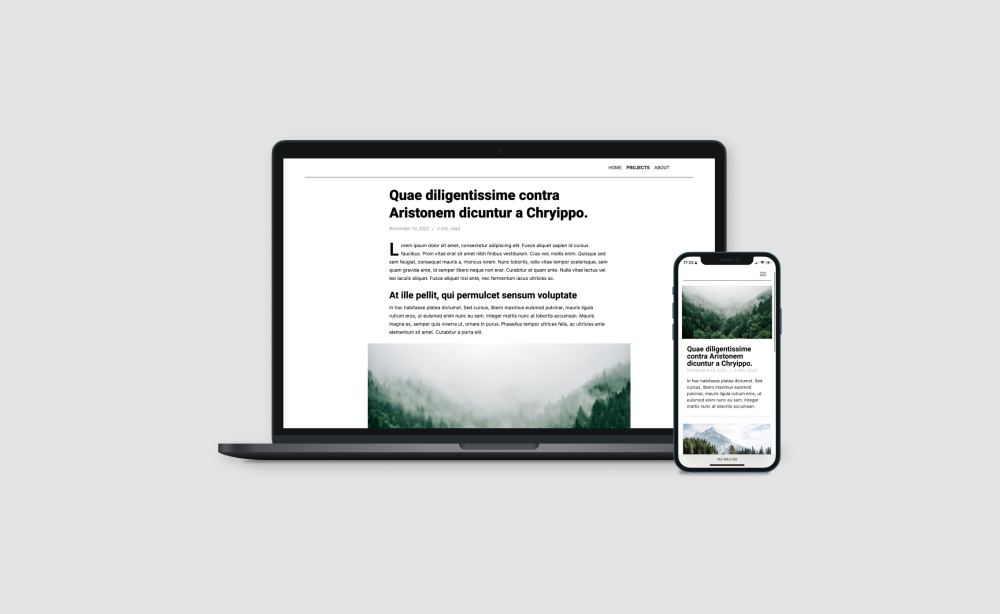
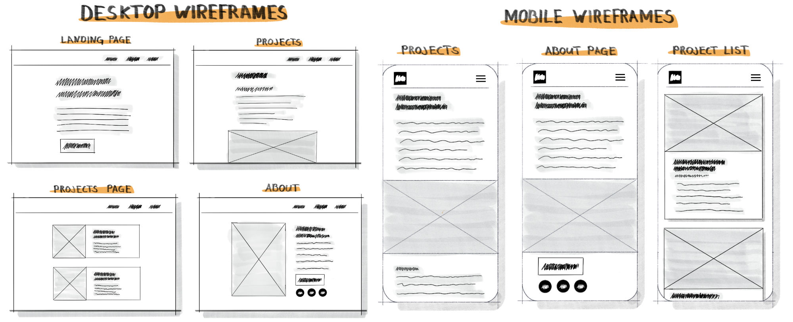

The goal was to create a self-hosted website that can be used as a portfolio to showcase some of my projects. In the past, I hosted through Squarespace, but I wanted more control over the site and also used it to learn more about server setups. The repository for the this website can be found on my [GitHub](https://github.com/Simon-Oliver/portfolio-website).

The site is hosted on a Linode VPS running Linux. Content, such as posts and potential blog posts, are written in Markdown and then converted into static HTML pages. I've settled on [eleventy (11ty)](https://github.com/11ty/eleventy) as the static site generator due to its speed and the fact that I'm already familiar with JavaScript and Node.js. In addition, eleventy seems pretty solid and supports various templating formats, such as Markdown and Nunjucks.



## Deployment

Automatic deployment is handled with GitHub actions. This allows new content or changes to be automatically built and deployed when pushing to my main branch. If interested, I use the GitHub workflow below to build and deploy to my server.

```yaml
name: github-deploy
on:
  push:
    branches:
      - main
jobs:
  write-to-console:
    runs-on: ubuntu-latest
    strategy:
      matrix:
        node-version: [18.x]
    steps:
      - uses: actions/checkout@v2
      - name: Use Node.js ${{ matrix.node-version }}
        uses: actions/setup-node@v1
        with:
          node-version: ${{ matrix.node-version }}

      - name: Install dependencies & build
        run: |
          npm ci
          npm run build
      - name: Install SSH Key
        uses: shimataro/ssh-key-action@v2
        with:
          key: ${{ secrets.SSH_PRIVATE_KEY }}
          known_hosts: "placeholder"
      - name: Adding Known Hosts
        run: ssh-keyscan -H ${{ secrets.SSH_HOST }} >> ~/.ssh/known_hosts
      - name: Deploy with rsync
        run: rsync -avz ./public/* ${{ secrets.SSH_USER }}@${{ secrets.SSH_HOST }}:/var/www/stauffersimon.com
```

## Design

The site's design was inspired by wired.com and nike.com, which have clean and sophisticated looks. I wanted to create a similar aesthetic for my portfolio, so I used clean fonts and a simple layout. No framework was used, and the CSS was written from scratch. To explore the site's basic layout, I created low-fidelity wireframes for both mobile and desktop versions. This allowed me to experiment with different designs and navigation options before moving to Figma to work out the final details.



In Figma, I focused on creating cohesive spacing and typography to create a clean, professional look. For the body text, I choose [Inter](https://github.com/rsms/inter). Inter is a font specifically designed for screens with a tall x-height to improve readability. For the headings, I used [Roboto](https://fonts.google.com/specimen/Roboto) to add a little more weight and emphasis. Finally, I used drop caps for each paragraph's first letter to add some interest to the design. My goal was to create a clean, sophisticated portfolio site that showcases my projects and skills professionally. The design achieves this while still being visually interesting and engaging for visitors.

Overall, the process of creating and hosting my own website has been a valuable learning experience. I've gained a deeper understanding of server setups and deployment, and I'm excited to continue developing and improving my site in the future.
