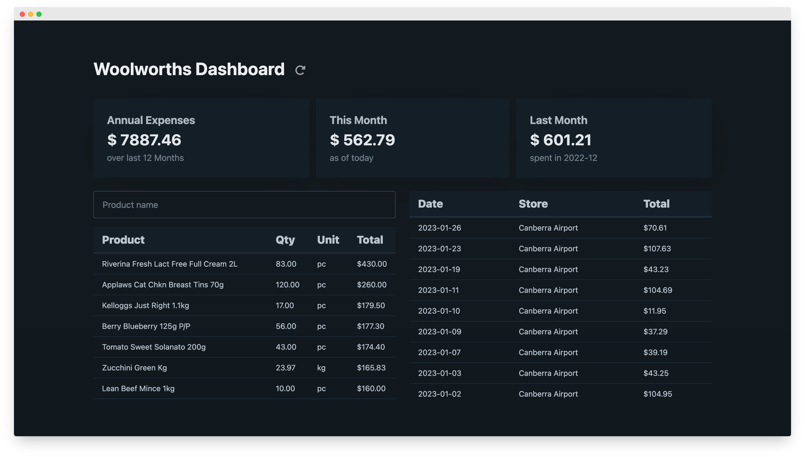
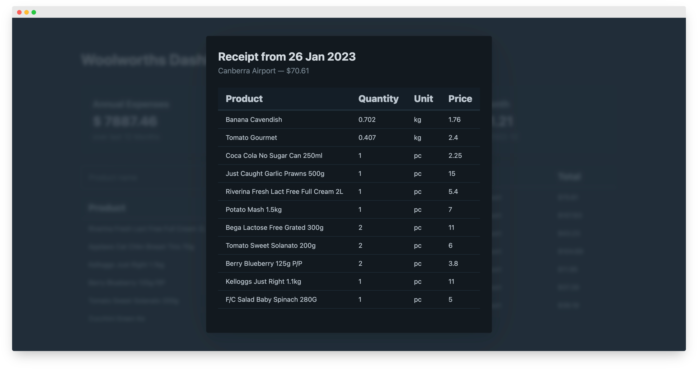

Woolworths is probably the biggest supermarket chain in Australia and our grocery store of choice. Like many other supermarkets, they have a rewards program that lets you collect points and provides an app to track the progress of said points. The app also allows you to access your receipts in PDF, looking like the paper version one gets at the checkout. At the moment, however, the receipts are only accessible individually, and the app doesn't provide any other metrics than collected points. So, looking for a new project and interested in how much we spend on monthly groceries and what items we purchase the most, I set out to explore Woolworth's unofficial API.



<div class="noteWarning">
<b>Note:</b> Accessing receipts and items this way might be against Woolworth's terms & conditions, which could lead to your account being blocked. <br><b>Use at your own risk!</b>
</div>

The obvious starting point was to inspect the everyday rewards website, which provides the same functionality as the app. I was able to access an endpoint that, given a bearer token, returned the data I was after in JSON format. Unfortunately, the bearer token does expire after only 30 minutes, and it does not seem like a refresh token is provided. To get new receipts, I'd have to go through the whole login flow. The app, on the other hand, stayed logged in. To inspect what endpoints the app was accessing, I used [mimtproxy](https://mitmproxy.org/) to intercept the requests. It turned out that the app was calling an endpoint that provided a refresh token set to a whopping 38879999 seconds (approx 14.7 months) before it expired. Although it is a little more involved to retrieve the initial refresh token, I can now fetch new receipts without logging in.

The rest of the project was straightforward. The returned JSON data is parsed into an SQLite database. For each receipt, items are returned in a JSON array. If only one item was purchased, there is one entry in the array. For multiple purchases of the same thing, there are two entries, one describing the item itself and the second describing the quantity.

**Single Item:**

```json
{
  "prefixChar": "#",
  "description": "Peters Original I/cream Neapolitn 4l",
  "amount": "10.90"
}
```

**Multiple Items:**

```json
{
  "prefixChar": null,
  "description": "Sirena Tuna In Oil Italian Style 95g",
  "amount": ""
},
{
  "prefixChar": null,
  "description": "Qty 3 @ $2.95 each",
  "amount": "8.85"
}
```

Having the data in an SQL database makes it easy to add additional reporting in the future if needed. More importantly, the database allows for the collection of historical records, given that Woolworths rewards currently only stores receipts for the past 14 months.

The data is visualised through a simple Flask GUI using the very lightweight CSS framework [Pico.css](https://picocss.com/) for the styling.



Although a simple project overall, it was an excellent opportunity to practice reverse engineering an existing API and explore new tools while refreshing general programming skills such as SQL. After seeing that our largest expense is milk, I might need to take up raising cows soon.
